# Uber-Data-Analysis-Project-2025-SQL

## Table of Contents

* [Background Overview](#background-overview)
* [Data Structure and Overview](#data-structure-and-overview)
* [Project Assumptions and Limitations](#project-assumptions-and-limitations)
* [Executive Summary](#executive-summary)
* [Deep-Dive Insights](#deep-dive-insights)
* [Recommendations](#recommendations)

---

## Background Overview

Uber has evolved into a multi-modal ride-sharing platform offering services across a range of vehicles. Operating across over 125 cities, Uber India faces a unique set of operational challenges, including high traffic congestion in urban centers, diverse customer demographics with varying price sensitivities and a massive, decentralized fleet of driver-partners. This complex and high-growth environment provides an ideal backdrop for a deep-dive analytical study.  
  
**Note**: This project utilizes a synthetically generated dataset modeled after real-world ride-sharing dynamics. It is designed specifically for portfolio demonstration to showcase advanced analytical capabilities in a complex business environment.

## **Data Structure and Overview**

This section of your portfolio provides a technical blueprint of the project. It describes how different data points—from a user’s click on a phone to a driver’s completed trip—are connected through a relational schema.

### **Entity Relationship Diagram (ERD)**

The project is built on a **Star Schema** architecture, designed for optimized analytical querying. At the center sits the transactional data, which is supported by various dimension tables providing context on users, drivers, geography, and vehicle types.

 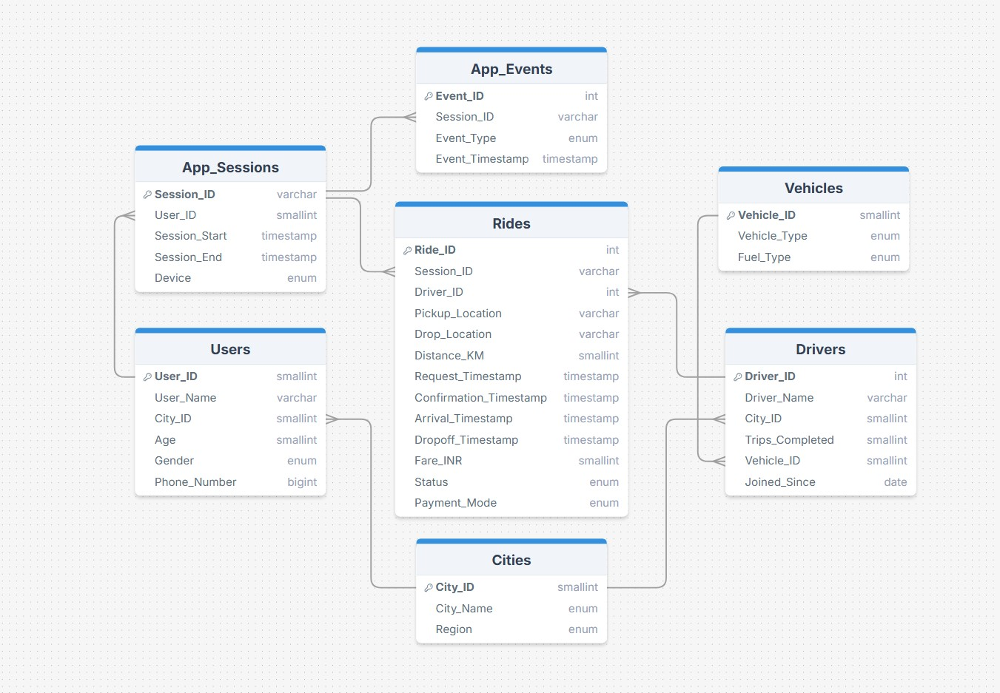

### **Table Descriptions**

The dataset consists of **seven interconnected tables**, capturing a 360-degree view of the Uber India marketplace in 2025.

#### **1. `Rides`**

* **Purpose:** The central transaction log containing every ride request made on the platform.
* **Key Metrics:** Ride Status (Completed, Cancelled, No Driver Found), Fare (INR), Distance (KM), and Timestamps.
* **Primary/Foreign Keys:** `Ride_ID` (PK), `Session_ID` (FK), `Driver_ID` (FK).

#### 2. `App_Sessions`

* **Purpose:** Tracks the "entry point" of every user. Every time a user opens the app, a unique session is created.
* **Key Metrics:** Device Type (iOS, Android, Web), Session Start/End times.
* **Primary/Foreign Keys:** `Session_ID` (PK), `User_ID` (FK).

#### 3. `App_Events`

* **Purpose:** A granular log of user behavior within a session. It records every button click (Event) before a ride is booked.
* **Key Metrics:** Event Type (e.g., 'home page', 'confirm pick-up', 'search failure').
* **Primary/Foreign Keys:** `Event_ID` (PK), `Session_ID` (FK).

#### 4. `Users`

* **Purpose:** Provides demographic context for the riders.
* **Key Metrics:** User Age, Gender, and Phone Number.
* **Primary/Foreign Keys:** `User_ID` (PK), `City_ID` (FK).

#### 5. `Drivers`

* **Purpose:** Contains attributes of the supply side (the driver partners).
* **Key Metrics:** Total Trips Completed (Historical) and Joining Date.
* **Primary/Foreign Keys:** `Driver_ID` (PK), `Vehicle_ID` (FK), `City_ID` (FK).

#### 6. `Cities`

* **Purpose:** Provides geographical context for the entire marketplace.
* **Key Metrics:** City Name (e.g., Bengaluru, Mumbai, Delhi-NCR) and Region.
* **Primary/Foreign Keys:** `City_ID` (PK).

#### 7. `Vehicles`

* **Purpose:** Defines the "Product Tiers" available on the platform.
* **Key Metrics:** Vehicle Type (Uber Go, Uber Auto, Uber Green, Premier, XL) and Fuel Type.
* **Primary/Foreign Keys:** `Vehicle_ID` (PK).

## **Project Assumptions and Limitations**

### **Analytical Assumptions**

* **Linear User Journey & Post-Confirmation Exit:** The app journey follows a sequential path: `Home Page`  `Where to?`  `Choose a Ride`  `Confirm Pick-up`. From here, the journey either ends in a `No Driver Found` state or a `Ride Confirmed` state. **Crucially, even after a ride is confirmed, a user has the provision to "Cancel the Ride"** due to change of intent or excessive wait times.
* **Cancellation Timing & Null States:** It is assumed that all cancellations (by both riders and drivers) occur **prior to the driver's arrival** at the pickup location. Consequently, the `Arrival_Timestamp` is always null for these records, and no "Waiting Fee" is applied.
* **Single-Stop Constraint:** Every ride request is restricted to a maximum of **one stop**. Multi-stop routing or dynamic route changes during a trip were not factored into the distance or fare calculations.
* **Static Take-Rate:** The platform commission is calculated at a fixed **25% of the total fare** across all vehicle tiers and regions, reflecting a simplified revenue model for the 2025 fiscal year.

### **Project Limitations**

* **Absence of Sentiment & Quality Metrics:** The study does not incorporate **Driver or User Ratings**. Therefore, the analysis cannot correlate churn or cancellations with the quality of the service provided by the driver or the behavior of the rider.
* **Exclusion of Macro-Variables:** The analysis does not account for **external factors** such as weather patterns (e.g., monsoon impact on Uber Auto demand), local fuel price hikes, or major city-wide holidays.
* **Geospatial Simplification:** While pickup and drop-off points are identified, the study treats routing as a function of distance and time without accounting for real-time traffic congestion or road closures.

### **The SQL Toolkit**

To transform this raw data into strategic insights, the project leverages advanced SQL functions used in an abstract, modular sense:

* **Common Table Expressions (CTEs)**
* **Window Functions**
* **Offset Functions**
* **Joins**
* **Conditional Aggregations**
* **Date & Timestamp Manipulation**

## **Executive Summary**

The following Executive Summary provides a data-driven overview of Uber India’s 2025 performance, focusing on revenue integrity, operational bottlenecks, and user loyalty.

The 2025 fiscal year analysis reveals a platform driven by the **South region**, which generated approximately **₹2.42 million** in gross platform revenue, followed closely by the **West at ₹2.40 million**. At the city level, **Kolkata** leads in revenue at **~₹1.22 million**, but it also experiences the highest revenue leakage, losing approximately **₹281,296** to "No Driver Found" (NDF) and driver cancellations. Despite these challenges, the platform maintained a strong **77.99% session-to-booked-ride conversion rate**, converting **54,559 sessions** into bookings out of **69,955 total sessions**. Monthly ride volume showed notable volatility, with a **9.27% dip in February** followed by a **9.20% recovery in March**, eventually stabilizing at **4,144 completed rides in December**.

Marketplace health is currently impacted by significant operational friction. **Hyderabad** reported the highest percentage of **under-utilized drivers at 50.79%**. Supply density issues are most evident in **Pune**, which recorded the highest average driver arrival lag of **7 minutes and 32 seconds**. Specific localities like **Hayathnagar in Hyderabad (3.43%)** and **Chanakyapuri in Delhi-NCR (3.39%)** were identified as having the highest cancellation rates, pinpointing areas where drivers are most reluctant to operate. Furthermore, **11 PM (Hour 23)** emerged as the most critical time for marketplace failure, recording **206 "No Driver Found" events**.

User behavior analysis distinguishes **Top 5% Power Riders**, who prefer **Cash (21.20% share)**, from the **Bottom 95% regular riders**, who favor the **Uber Wallet (20.29% share)**. Interestingly, **Cash** and **UPI** tied for the highest completion-to-cancellation ratio at **4.69**, indicating these methods lead to the lowest "flake" rates among riders. On the supply side, **Bikes** handled the highest booking volume (**7,985**), while **Premier vehicles** achieved the highest success rate at **75.90%**.

Device-specific data indicates that **iOS** users have a slight lead in conversion at **69.94%**, but **Android** users generate the highest engagement value with a **revenue per session of ₹593.25**. Finally, the platform faces a critical retention challenge with **1,416 "At-Risk" users** who have an average historical spend of **₹3,338** but have been inactive for an average of **129 days**.

This section provides an exhaustive breakdown of the analytical findings across 13 key business questions. Each insight is derived directly from the observed data outputs and focuses on the structural patterns and metrics found within the 2025 marketplace simulation.

## **Deep-Dive Insights**

### **I. Financial & Marketplace Performance**

This category focuses on the economic health of the platform, identifying primary revenue drivers and quantifying "value leakage" from missed opportunities.

**Key Category Insights:**

* The marketplace shows a clear hierarchy with the **South region** leading at **2,420,306.75**, followed closely by the **West**. The **North** and **East** regions contribute significantly less, each generating roughly half of the revenue seen in the leading markets.

* **Kolkata** is the top-performing city with **1,225,311.94** in gross revenue, yet it simultaneously faces the highest **Platform Revenue Loss** of **281,296.72** due to cancellations and supply failures.

* While regular riders show a balanced distribution across all payment methods, the **Top 5% Power Riders** exhibit a distinct peak in **Cash usage (21.20% share)** and a notable decline in **Uber Wallet usage (18.83%)** compared to the bottom 95%.

* Ride volume peaked in **January (4,218 rides)** and **December (4,144 rides)**. The data shows a volatile first quarter with a **9.27% drop in February** followed immediately by a **9.19% surge in March**.

| Business Question | Data Visualization (Output) |
| --- | --- |
| **Q.1** Measure the Gross Platform Revenue (25% commission) for each region and rank them from highest to lowest. | 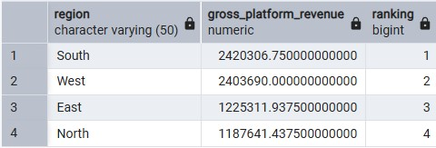 |
| **Q.2** Measure city-level performance by calculating Gross Platform Revenue, Total Completed Rides, Average Fare, and Shadow Revenue. | 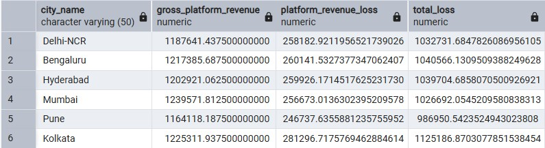 |
| **Q.3** Identify the Top 5% of Power Riders in each city and determine if their preferred payment mode differs from the bottom 95%. | 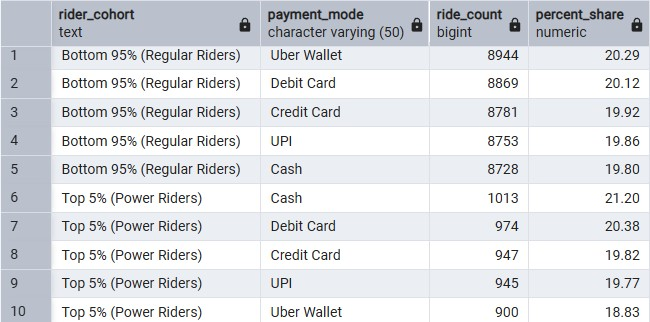 |
| **Q.4** Calculate the Month-over-Month (MoM) Growth Percentage in total completed ride volume. | 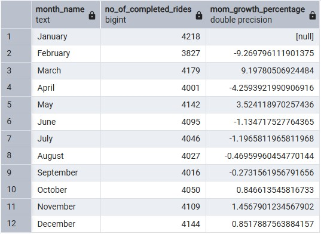 |

### **II. Operational & Logistics Efficiency**

This section audits the physical performance of the fleet and the geographical bottlenecks that disrupt marketplace equilibrium.

**Key Category Insights:**

* **Bikes** handled the highest volume of bookings (**7,985**), while **Premier** rides achieved the highest **Success Rate (75.90%)**. Interestingly, **Uber XL** and **Uber Green** show higher average distances per ride compared to standard tiers.

* Driver arrival delays are consistent across major cities, with **Pune** reporting the longest average lag of **7 minutes and 32 seconds**, while **Delhi-NCR** maintains the lowest average lag at **7 minutes and 27 seconds**.

* Cancellation rates peak in specific neighborhoods such as **Hayathnagar (3.43%)** and **Chanakyapuri (3.39%)**. The data identifies up to five distinct bottleneck zones per city where cancellations are notably higher than the city average.

* A significant portion of the driver base is under-utilized, with **Hyderabad** leading this metric at **50.79%** of drivers falling into the bottom 25% of trip volume for their city.

* The highest frequency of marketplace failure occurs at **Hour 23 (11 PM)**, where **206 "No Driver Found"** events were recorded, representing a critical supply-demand gap in late-night windows.

| Business Question | Data Visualization (Output) |
| --- | --- |
| **Q.5** Compute the vehicle fleet coverage in terms of Total bookings, Success rate, Average distance, and Total distance. | 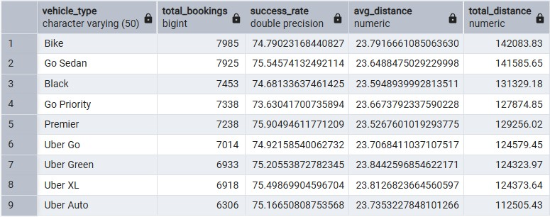 |
| **Q.6** Measure the average Driver Arrival Lag for each city to identify traffic or supply density delays. | 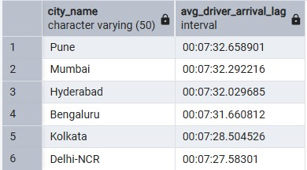 |
| **Q.7** Identify the top 5 Pickup Localities in each city with the highest cancellation rates. | 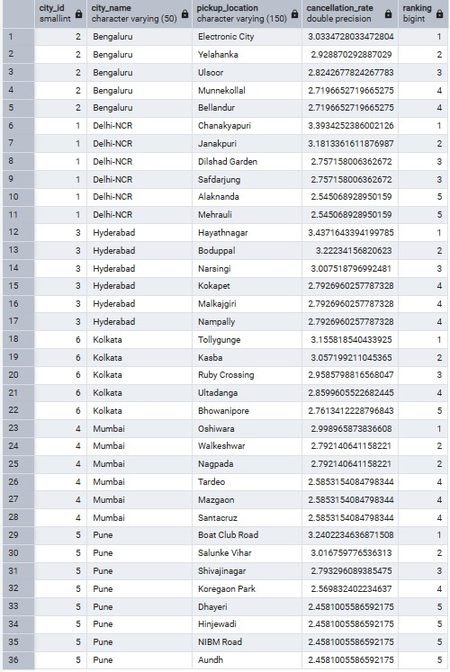 |
| **Q.8** Identify the percentage of Under-Utilized Drivers falling in the bottom 25% of monthly trip volume. | 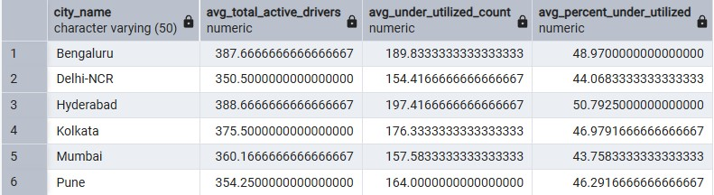 |
| **Q.9** Identify the specific Hour of the Day with the highest frequency of 'No Driver Found' statuses. |  |

### **III. User Behavior & Product Insights**

This category examines the technical performance of the application and the behavioral triggers that lead to ride completion or abandonment.

**Key Category Insights:**

* The app recorded **54,559 booked rides** out of **69,955 sessions**, resulting in a high **77.99% session-to-booked conversion rate**, indicating strong user intent once the app is opened.

* Completion-to-cancellation ratios are remarkably consistent across payment modes, hovering around **4.69** for **Cash, UPI, and Debit Cards**, though **Uber Wallet** shows a slightly lower ratio of **4.47**.

* The analysis identified **1,416 "At-Risk" users**. This group has an average historical spend of **3,338** but has been inactive for an average of **129 days**.

* **iOS** leads in conversion rate at **69.94%**, but **Android** users contribute the highest **Revenue per Session (593.25)**, marginally outperforming both Web and iOS in session value.

| Business Question | Data Visualization (Output) |
| --- | --- |
| **Q.10** Calculate the Session-to-Booked-Ride Conversion Rate to measure app effectiveness. | 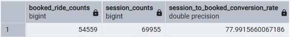 |
| **Q.11** Compare the Completion-to-Cancellation Ratio for rides booked via different modes of payment. | 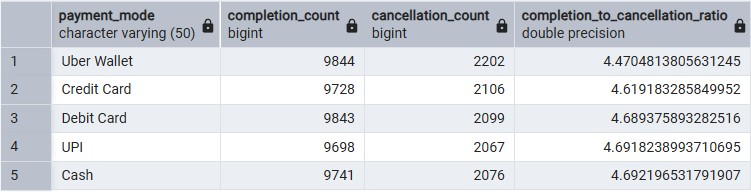 |
| **Q.12** Perform an RFM Analysis to identify the total count of "At-Risk" users. | 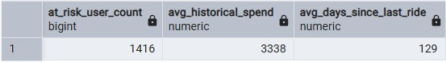 |
| **Q.13** Evaluate device-driven differences in conversion, value generation, and engagement. | 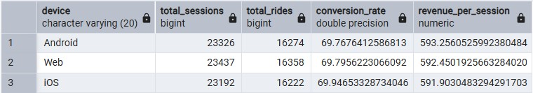 |

## **Recommendations**

Based on the comprehensive analysis of the 2025 Uber India dataset, the following strategic actions are proposed to optimize marketplace performance and drive long-term growth.

1. To mitigate the substantial revenue leakage observed in high-performing cities like Kolkata, the platform should implement a location-based incentive model for drivers. This model should specifically target identified high-friction zones such as Hayathnagar and Chanakyapuri, where cancellation rates are disproportionately high. By offering localized performance bonuses in these "bottleneck" areas, the platform can improve supply density and reduce the significant "Shadow Revenue" currently lost to unmet demand.

2. Operational efficiency in cities with high arrival lags, particularly Pune, can be improved by refining the dispatch algorithm to prioritize proximity over tiered availability during peak traffic windows. This approach will help lower the average arrival time, thereby reducing the likelihood of user-side cancellations caused by wait-time frustration. Additionally, addressing the high percentage of under-utilized drivers in markets like Hyderabad is critical; implementing a tiered "active-hour" reward system could incentivize these partners to maintain higher trip volumes, improving overall marketplace liquidity.

3. To capitalize on late-night demand, surge pricing algorithms and driver "shift-completion" incentives should be re-calibrated for the 11 PM window. This specific timeframe consistently records the highest frequency of supply failure, and targeted interventions here could recover a significant portion of missed bookings. Furthermore, promoting digital payment methods such as UPI and Debit Cards can stabilize the marketplace, as these modes correlate with higher completion-to-cancellation ratios compared to wallet-based transactions.

4. For user retention, a proactive "Service Recovery" campaign should be deployed for the high-volume "At-Risk" segment. These users, who have a strong history of high spending but have remained inactive for over four months, require targeted re-engagement strategies—such as personalized loyalty discounts—to prevent permanent churn.

5. Finally, technical optimizations should focus on the Android user base; while these users generate high revenue per session, improving the technical conversion funnel to match the efficiency of iOS would ensure that high user intent consistently translates into completed transactions.

---

Important Links:  
Uber Dataset -->   
Queries Analysis --> 

